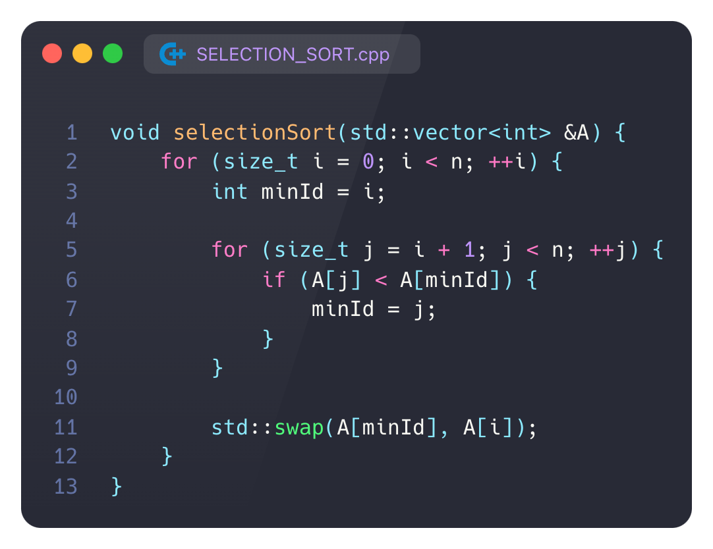

# A1

## 1. Сформулируйте условие $P1$ , которое подходит в качестве инварианта внутреннего цикла алгоритма по $j$. Представьте краткое обоснование (например, с использованием частичной трассировки выполнения цикла).

$P1$ : $A[minId] = min(A[i..j])$

докажем с метода мат.индукции

во время захода в цикл условие выполняется, потому что это минимум из одного элемента

ШАГ.

Пусть условие выполняется для $j$, докажем что выполняется для $j+1$

Если $A[j+1]<A[minId]$ тогда $minId = j+1$ условие продолжает выполнятся

В обратном случае условие тем более продолжает выполнятся

ч.т.д.

## 2. (Сформулируйте условие $P2$, которое подходит в качестве инварианта внешнего цикла алгоритма по $i$. Представьте краткое обоснование.

$P2:$ в конце итерации  $A[..i] = sorted(A)[..i]$

докажем методом мат.индукции

БАЗА:

Первый цикл по $j$ найдет наименьший элемент массива, тем самым условие будет выполнятся

ШАГ:

пусть условие выполняется для $i$, докажем для $i+1$

внутренний цикл найдет наименьший элемент среди $A[i+1..]$ 

свопом мы поставим его на место $i+1$ тем самым инвариант продолжит выполнятся
