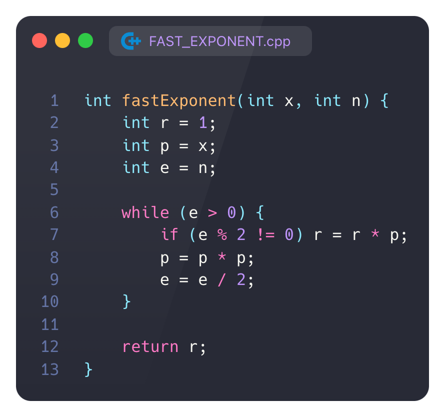

<script type="text/javascript"
  src="https://cdnjs.cloudflare.com/ajax/libs/mathjax/2.7.0/MathJax.js?config=TeX-AMS_CHTML">
</script>
<script type="text/x-mathjax-config">
  MathJax.Hub.Config({
    tex2jax: {
      inlineMath: [['$','$'], ['\\(','\\)']],
      processEscapes: true},
      jax: ["input/TeX","input/MathML","input/AsciiMath","output/CommonHTML"],
      extensions: ["tex2jax.js","mml2jax.js","asciimath2jax.js","MathMenu.js","MathZoom.js","AssistiveMML.js", "[Contrib]/a11y/accessibility-menu.js"],
      TeX: {
      extensions: ["AMSmath.js","AMSsymbols.js","noErrors.js","noUndefined.js"],
      equationNumbers: {
      autoNumber: "AMS"
      }
    }
  });
</script>

# A2



## 1. Какое точное количество операций умножения требуется выполнить, чтобы вычислить $x^n$ с помощью алгоритма FAST EXPONENT? Всегда ли данный алгоритм лучше наивного способа вычисления?

в цикле мы выполним $log_2n+1$ операций возведения $p$ в квадрат и столько же операций деления $e$ пополам и ``` std::popcount(n) ``` (количество единиц в бинарной записи числа) умножений ```r=r*p```

итого в функции мы выполним

$X(n) = 2\lfloor log_2n\rfloor +std::popcount(n) +5$

не всегда эта функция выгодна, когда у нас маленький $n=2^k-1$ выгоднее умножить обычным способом

например при $n=3$ обычным способом получится 2 операции

а функцией $X(3) = 2+ 2+5=9$ операций

## 2. Сформулируйте условие P, которое подходит в качестве инварианта цикла while. Представьте достаточное обоснование выбора инварианта. Выполните проверку выполнения найденного инварианта  до входа в цикл (INIT), в каждой итерации цикла (MNT), а также при выходе из цикла (TRM).

### $P : p^er = x^n$

я выбрал этот инвариант, потому что по нему отчетливо видно, как при изменении $p^e$ меняется $r$, к тому же он выглядит красиво и лаконично

### INT

при входе в массив

$p = x$

$r = 1$

$e = n$

выходин инвариант выполняется:

$x^n = p^er = x^n$

### MNT

у нас известно что цикл выполнялся на предыдущей итерации

есть два варианта предыдущего условия

первый:

$\sqrt{p}^{2e}r=x^n$

тогда инвариант продолжает выполнятся

$p^er=x^n$

второй вариант

$\sqrt{p}^{2e+1}\dfrac{r}{\sqrt p}=x^n$

тогда

$\sqrt{p}^{2e}r=x^n$

тогда инвариант продолжает выполнятся

$p^er=x^n$

### TRM

в конце у нас получвется что

$r = x^n$, а $e = 0$

тогда

$p^0r=1r=x^n$

инвариант выполняется!