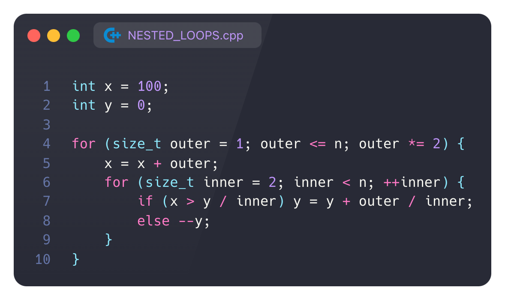

<script type="text/javascript"
  src="https://cdnjs.cloudflare.com/ajax/libs/mathjax/2.7.0/MathJax.js?config=TeX-AMS_CHTML">
</script>
<script type="text/x-mathjax-config">
  MathJax.Hub.Config({
    tex2jax: {
      inlineMath: [['$','$'], ['\\(','\\)']],
      processEscapes: true},
      jax: ["input/TeX","input/MathML","input/AsciiMath","output/CommonHTML"],
      extensions: ["tex2jax.js","mml2jax.js","asciimath2jax.js","MathMenu.js","MathZoom.js","AssistiveMML.js", "[Contrib]/a11y/accessibility-menu.js"],
      TeX: {
      extensions: ["AMSmath.js","AMSsymbols.js","noErrors.js","noUndefined.js"],
      equationNumbers: {
      autoNumber: "AMS"
      }
    }
  });
</script>


# A3



## 1. Составьте точное выражение для функции временной сложности T(n) c учетом того, что арифметическая операция, присваивание и сравнение считаются одной элементарной операцией (каждая). В ответе представьте ход вычислений.

внутри условного оператора 2 операции: деление и сравнение

при выполнении сравнения нужно выполнить 3 операции

иначе 1 операция

### давайте докажем что если во внутреннем цикле условие выполнилось хотя бы 1 раз, то оно будет выполнятся все следующие разы

и так у нас один раз выполнилось что $x>\frac{y}{inner}$

тогда сравним 

$lim _{n\to\infty}\frac{y+x\sum_k^n\frac{1}{i}}{n}=\lim \frac{y}{n}+x\frac{\sum\frac{1}{i}}{n}$ и $x$ 

перенесем сумму в правую часть и получим

$\frac{y}{n}$ и $x(1-\frac{\sum\frac{1}{i}}{n})$

левая часть стремится к 0, а правая к $x$

ч.т.д. если условие внутри цикла выполнилось 1 раз, то оно и дальше внутри этого цикла будет выполнятся

значит это условие может не выполнится только в начале цикла, пока ```inner``` маленький 

### пусть наше условие не выполнится $k$ раз, это значит что

$\dfrac{y-k}{k}\geq x$

$\to$

$k\leq\frac{y}{x+1}$

тогда условие не выполнится $\dfrac{y}{x+1}$ раз

### давайте оценим, сколько на сколько повышается $y$ в конце каждого цикла по ```inner```

в этой строчке
```
y = y + outer / inner;
```

когда ```inner``` становится больше чем ```outer``` к $y$ прибавляется 0

таким образом в конце цикла по ```inner```

$y_{new} = y_0+outer\sum_2^{outer}\dfrac{1}{i}$

как мы знаем из матанализа $\sum\frac{1}{i}\to lnn + \gamma$

(где $\gamma$ постоянная эйлера)

тогда $y_{new} = y_0+ (outer)ln(outer)+\gamma$

тогда в $i$-тую итерацию цикла ```outer```

$y_i = \sum 2^jln2^j=\frac{1}{log_2e}\sum j2^j=$

$\dfrac{2(2^ii-2^i+1)}{log_2e}$

### что косается $x$

в $i$-тую итерацию цикла ```outer```, $x_i=2^{i+1}+99$

### теперь мы можем найти $k$ сколько раз условие не будет выполнятся:

$\frac{2^{i}(i-1)+2}{log_2e(2^{i+1}+99)}$

при больших $i$
стремится к

$\dfrac{i}{2log_2e}$

такми образом, условие не выполнится именно столько раз для каждого $x$ невыполнится условие


и как мы видим, действительно количество невыполнившихся увеличивается на 1 примерно каждые 4 итерации

### теперь мы можем посчитать временную сложность

$T(N)=2+log_2n(2+2+n(2+2+3)) - 2(1+1+1+1+2+2+2+2+3+...+lnn/2) = $

$2+log_2n(2+2+n(2+2+3)) - 2\dfrac{4lnn/2(lnn/2+1)}{2} = $

$2+log_2n(4+7n)-2lnn^2 = 7nlog_2n +4log_2n - 2lnn^2+2$

$T(N) = 7Nlog_2N+4log_2N-2ln^2N +2$

## 2. Найдите функцию $f(n)$, для которой справедливо соотношение $T(n) = θ(f(n))$. Обоснуйте свой ответ в соответствии с определением $θ$–нотации.

$f(N) = NlogN$

докажем:

$7Nlog_2N+4log_2N-2(lnN)^2 +2<CNlog_2N$

работает начиная с $C=10, N=16$

$448+16-32+2=434<640$

докажем ограничение снизу:

$7Nlog_2N+4log_2N-2(lnN)^2 +2>CNlog_2N$

работает начиная с $C=1, N=16$

$434>64$

ч.т.д.