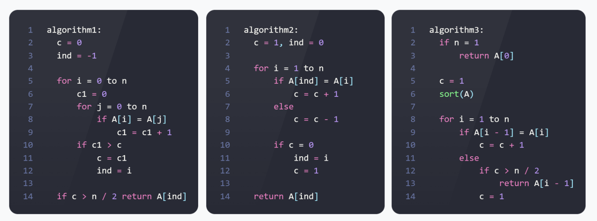

<script type="text/javascript"
  src="https://cdnjs.cloudflare.com/ajax/libs/mathjax/2.7.0/MathJax.js?config=TeX-AMS_CHTML">
</script>
<script type="text/x-mathjax-config">
  MathJax.Hub.Config({
    tex2jax: {
      inlineMath: [['$','$'], ['\\(','\\)']],
      processEscapes: true},
      jax: ["input/TeX","input/MathML","input/AsciiMath","output/CommonHTML"],
      extensions: ["tex2jax.js","mml2jax.js","asciimath2jax.js","MathMenu.js","MathZoom.js","AssistiveMML.js", "[Contrib]/a11y/accessibility-menu.js"],
      TeX: {
      extensions: ["AMSmath.js","AMSsymbols.js","noErrors.js","noUndefined.js"],
      equationNumbers: {
      autoNumber: "AMS"
      }
    }
  });
</script>

# A4 Разные алгоритмы решения одной* задачи



## 1. Утверждается, что представленные алгоритмы должны решать одну и ту же задачу, т. е., выдавать один и тот же ответ на одинаковых входных данных.

### Согласны ли вы с этим утверждением? Результаты работы каких алгоритмов из представленных могут отличаться? Какую задачу решает каждый алгоритм?

давайте вначале напишем какую задачу решает каждый алгоритм

-----
#### алгоритм1:

возвращает индекс элемента, которого в массиве больше половины

#### алгоритм2:

возвращает последний такой элемент, что если взять весь массив перед ним, то массив можно поделить на куски, в каждом из которых какой-то элемент повторяется больше половины раз


#### алгоритм3:

решает ту же задачу, что и 1 алгоритм, только он ничего не вернет если этот повторяющийся элемент будет максимумом

-----
Поэтому я не согласен, что эти алгоритмы решают одну задачу. Совершенно отличается 2й алгоритм, и 1й с 3и немного


### Приведите примеры входных данных, при которых результаты работы алгоритмов могут отличаться, а также совпадать. Поясните свой ответ с помощью трассировки (частичной) работы алгоритмов.

вначале приведу пример когда результаты совпадают

это случай такого массива

```python
[1,2,1,2,1,2,1]
```

во всех алгоритмах вернет $1$

давайте рассмотрим трассировку в каждом:

трассировка 1 алгоритма


| **i** | **c1** | **c** | **ind** |
|:-----:|:------:|:-----:|:-------:|
| 0     | 4      | 4     | 0       |
| 1     | 3      | 4     | 0       |
| 2     | 4      | 4     | 2       |
| ...   | ...    | ...   | ...     |
| 6     | 4      | 4     | 6       |

алгоритм вернет ```A[6]``` то есть 1

трассировка 2 алгоритма:

| **i** | **с** | **ind** |
|:-----:|:-----:|:-------:|
| 1     | 0     | 1       |
| 2     | 0     | 2       |
| ...   | ...   | ...     |
| 6     | 0     | 6       |

алгоритм тоже вернет элемент ```A[6]```

трассировка 3 алгоритма:

| **i** | **с** |
|:-----:|:-----:|
| 1     | 2     |
| 2     | 3     |
| 3     | 4     |


а этот алгоритм вернет ```A[3]``` отсортированного массива, которое совпадает с изначальным ```A[6]```

#### приведем пример в котором ответы не будут совпадать:

```python
[1,0,1,0,1,0,1]
```

давайте рассмотрим трассировку в каждом:

трассировка 1 алгоритма


| **i** | **c1** | **c** | **ind** |
|:-----:|:------:|:-----:|:-------:|
| 0     | 4      | 4     | 0       |
| 1     | 3      | 4     | 0       |
| 2     | 4      | 4     | 2       |
| ...   | ...    | ...   | ...     |
| 6     | 4      | 4     | 6       |

алгоритм вернет ```A[6]``` то есть 1

трассировка 2 алгоритма:

| **i** | **с** | **ind** |
|:-----:|:-----:|:-------:|
| 1     | 0     | 1       |
| 2     | 0     | 2       |
| ...   | ...   | ...     |
| 6     | 0     | 6       |

алгоритм тоже вернет элемент ```A[6]```

трассировка 3 алгоритма:

| **i** | **с** |
|:-----:|:-----:|
| 1     | 2     |
| 2     | 3     |
| 3     | 1     |
| ...   | ...   |
| 6     | 4     |

а этот алгоритм ничего не вернет

## 2. Вычислите асимптотическую верхнюю границу $O(f(n))$ временной сложности для каждого алгоритма. Обоснуйте свой ответ. Представлять полный расчет точного выражения функции временной сложности $T(n)$ не нужно.


в 1 алгоритме два вложенных независящих друг от друга цикла по $n$ во внутреннем совершается не больше 5 действий

поэтому верхнее ограничение $O(N^2)$

во 2 алгоритме только один цикла по $n$, внутри которого совершат не больше 8 действий

поэтому верхнее ограничение $O(N)$

в 3 алгоритме вначале производится сортировка массива, и после нее линейный цикл пробегает по массиву. Таким образом самой трудоемкой частью становится сортировка

поэтому верхнее ограничение $O(NlogN)$

## 3. Какие алгоритмы и каким образом необходимо доработать, чтобы в результате все представленные алгоритмы решали одну и ту же задачу? В ответе представьте инструкции, которые необходимо добавить или удалить.

вот так я изменил алгоритмы:

```python
# первый не стал менять, остальные привел к его виду
def alg1new(A,n): 
    c = 0
    ind = -1

    for i in range(n):
        c1 = 0
        for j in range(n):
            if A[i] == A[j]:
                c1 = c1 + 1
        if c1 > c:
            c = c1
            ind = i
    if c > n/2:
        return A[ind]

def alg2new(A,n):

    # Добавил эту часть чтобы изначально знать наипопулярнейший элемент
    times = {}
    for i in range(n):
        times[A[i]] = 0
    for i in range(n):
        times[A[i]] += 1
    most_popular = A[0]
    for i in times.keys():
        if times[i] > times[most_popular]:
            most_popular = i
    # -------------------------------------
    c = 1

    for i in range(n):
        if most_popular == A[i]: # поменял A[ind] на most_popular
            c = c + 1
        else:
            c = c - 1
        # убрал проверку с на 0 из цикла
    if c > 0: # поменял возврат функции
        return most_popular

def alg3new(A,n):
    if n == 1:
        return A[0]
    c = 1
    A.sort()
    for i in range(1,n):
        if A[i - 1] == A[i]:
            c = c + 1
        else:
            if c > n/2:
                return A[i - 1]
            else:
                c = 1
    if c > n/2:  # Добавил после цикла проверку условия,
        return A[i - 1] # чтобы не терять макс. элемент
```

[полный файл с этим кодом можно найти по ссылке](https://github.com/Babushkin05/HSE_SE_ALGO/tree/main/BDZ1)

## 4. Докажите, что представленные вами доработки не ухудшают ранее вычисленные в п.2 верхние границы временной сложности. Представьте расчеты верхних границ сложности доработанных алгоритмов.

### ```alg1new()```

алгоритм не изменился, временная сложность та же

### ```alg2new()```

к алгоритму прибавилось 3 линейных цикла в которых я работаю с ```dict``` асимптотика которого $O(1)$, значит верхняя граница добавленной части $O(N)$ такая же как и у бывшей части, значит верхняя граница временной сложности не изменилась.

### ```alg3new()```

я добавил только 4 новых операции, поэтому старая верхняя граница в $O(NlogN)$ не изменилась