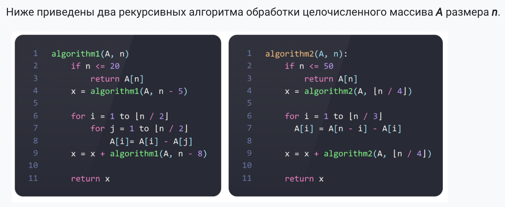

# A1. Временная сложность рекурсии

## 1. Для каждого из представленных алгоритмов составить рекуррентное соотношение, которое выражает их временную сложность $T(n)$. Обратите внимание, что рекуррентное соотношение должно давать полное представление о сложности алгоритма, т.е., охватывать как рекурсивную, так и нерекурсивную ветку вычислений. Предполагается, что все арифметические операции выполняются за постоянное время.

### алгоритм 1:

$\begin{cases}
T(N) = T(N-5)+T(N-8) + сN^2 \\\\
T(K) = с, k\leq20
\end{cases}$

### алгоритм 2:

$\begin{cases}
T(N) = 2T(N/4) + сN\\\\
T(K) = с, K\leq50
\end{cases}$

## 2. Вычислите асимптотическую точную границу $Θ(f(n))$ временной сложности для каждого из представленных алгоритмов, если это возможно. В случае невозможности формирования асимптотической точной границы, представить отдельно верхнюю и нижнюю границы. Обоснуйте свой ответ с помощью метода подстановки, дерева рекурсии, или итерации.

### алгоритм1:

воспользуемся методом подстановки

### алгоритм2:

воспользуемся методом итерации:

$T(N) = 2T(N/4) + cN = 4T(N/16) + \frac{cN}{2} + cN = 2^k(T/4^k)+\sum^k_{i=0}\frac{cN}{2^i} = \sum^{log_4(N-50)}_{i=0}\frac{cN}{2^i}=cN\sum\frac{1}{2^i}=2cN$

получилось:

$T(N) = c'N$

тогда $T(N) = \Theta(N)$

покажем:

$c`N\leq C_1N$

для любого $N$ при $C_1 = c'+1$

$c'N\geq C_2N$

для любого $N$ при $C_2 = c'-1$
