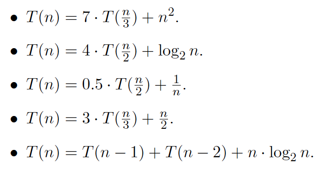

# A2. Применение мастер–теоремы

## Дан ряд рекуррентных соотношений, которые описывают временную сложность некоторых рекурсивных алгоритмов 
(при n = 1 во всех случаях принимаем T(1) = 1):

## 1. Для приведенных рекуррентных соотношений вычислите асимптотическую верхнюю границу  временной сложности O(g(n)) с помощью основной теоремы о рекуррентных соотношениях (мастер-теоремы), если это возможно. Если применение мастер-теоремы невозможно, поясните причины.

для начала запишем мастер-теорему:

$T(n) = aT(n/b) + O(n^kf(n))$

$T(n) = \begin{cases}
log_ba = k: O(n^{k}f(n)logn)\\\\
log_ba < k: O(n^kf(n)) \\\\
log_ba > k: O(n^{log_ba}f(n))
\end{cases}$

условия:

$\begin{cases}
a\geq1\\\\
b>1\\\\
k>0\\\\
f(n) - монотонно\ возрастающая\ функция
\end{cases}$

### 1)

$a = 7, b=3,k=2,f(n)=1$

$\to T(n) = O(n^2)$

### 2)

$a=4,b=2,k=0,f(n)=log_2n$

$\to T(n) = O(n^{2}logn)$

### 3)

$a=0.5,b=2,k=-1$ 

такие коэффициенты не подходят для использования мастер-теоремы, поэтому вычислить  не получится

### 4)

$a=3, b=3, k=1,f(n)=1$

тогда $T(n) = O(nlogn)$

### 5)

мастер-теорема разделяй и властвуй не применима, потому что рекурсия вызывается не от кратно меньшего аргумента, а от аргумента меньшего на константу

заметим, что

$T(n) = T(n-1) + T(n-2) + nlogn <2T(n-1)+ nlogn$

здесь применима мастер-теорема уменьшай и властвуй

по ней для 

$T'(n) = 2T'(n-1) + nlogn$

$T'(n) = O(2^nnlogn)$

так как это верхняя граница для $T`(n)$, то это и верхняя граница для $T(n)$

## 2. Для рекуррентного(-ых) соотношения(-ий), не разрешимых с помощью мастер-теоремы, определите возможную асимптотическую верхнюю границу, используя метод итерации или метод подстановки.

### 3)

воспользуемся методом итерации:

$T(n) = \frac{1}{2}T(n/2) + \frac{1}{n} = \frac{1}{4}T(n/4) + \frac{2}{2n} + \frac{1}{n} = \frac{1}{n} + ... +\frac{1}{n} = \frac{log_2n}{n}$

получилось

$T(n) = \frac{log_2n}{n}$

тогда

$T(n) = O(\frac{log_2n}{n})$

