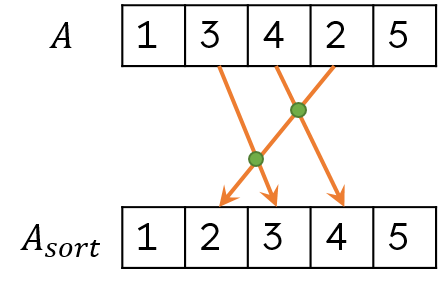

# А4. Значительные инверсии

## Рассмотрим механизм подсчета так называемой степени упорядоченности некоторого целочисленного массива $A = [a_1, a_2, a_3, ..., a_n]$, заполненного уникальными значениями.

## Элементы $a_i$ и $a_j$ массива A назовем инвертированными, если $i < j$, но $a_i > a_j$. Например, в массиве $A = [1, 3, 4, 2, 5]$  достаточно выполнить две инверсии, а именно $3 ↔ 2$ и $4 ↔ 2$  (см. количество пересечений стрелок на рисунке ниже), чтобы получить отсортированный массив $A' = [1, 2, 3, 4, 5]$.



## 1. Разработайте DaC-алгоритм CINV, временная сложность которого должна соответствовать $O(n log n)$, для подсчета степени упорядоченности массива путем вычисления количества необходимых перестановок. Описание алгоритма представьте в любом удобном формате. Опишите суть шагов DIVIDE, CONQUER и COMBINE, а также представьте рекуррентное соотношение для $T(n)$ и обоснуйте соответствие требуемой асимптотической верхней границе временной сложности. Проанализируйте, возвращает ли разработанный вами алгоритм СINV минимальное количество необходимых инверсий.

Придуманный мною алгоритм является расширенным алгоритмом ```merge_sort()```

[полный код можно посмотреть по ссылке](https://github.com/Babushkin05/HSE_SE_ALGO/blob/main/BDZ2/A4-annex.cpp)


```cpp
int extended_merge_sort(int l, int r){
    if(l+1>=r){ 
        return 0;
    }
    int m = (l+r)/2;
    int ans = 0;
    ans += extended_merge_sort(l,m);
    ans += extended_merge_sort(m,r);
    ans += count_inversions(l,r);
    merge(l,r);
    return ans;
}
```
-----
### опишем каждые из шагов

DIVIDE - делим массив на две части, и вызываем нашу функцию от обоих частей, считаем эту сумму 

CONQUER - когда в нашем диапазоне 1 элемент возвращаем 0 (именно столько инверсий в массиве с 1 элементом). И при этом массив из 1 элемента считается отсортированным.

COMBINE - найдем количество инверсий между нашими половинами:


```cpp
int count_inversions(int l, int r){
    int res = 0;
    int m = (l+r)/2;
    int i = l;
    int j = m;
    while(i < m && j < r){
        if(v[i]>v[j]){
            res += j - m + 1;
            ++j;
        }
        else{
            ++i;
        }
    }

    return res;
}
```

эта функция знает, что при ее вызове каждая половина отсортирована

а значит можно за линию найти количество инверсий

если $i$-е число в левой половине больше $j$-го числа в правой половине, то оно больше и всех чисел перед $j$

После подсчета инверсий между половинами, мы [стандартно](https://github.com/Babushkin05/HSE_SE_ALGO/blob/main/BDZ2/A4-annex.cpp) мерджим эти 2 половины в один отсортированный массив.

----

опишем рекуррентное соотношениие временной сложности:

$\begin{cases}
T(n) = 2T(n/2) + O(n)\\\\
T(1) = O(1)
\end{cases}$

по мастер-теореме разделяй-и-властвуй:

$T(n) = O(nlogn)$