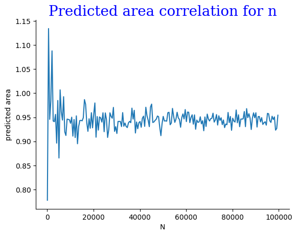
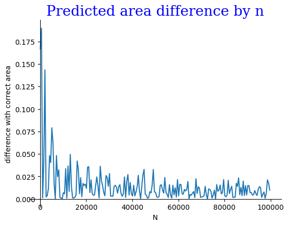
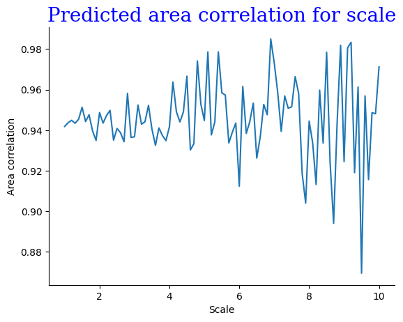
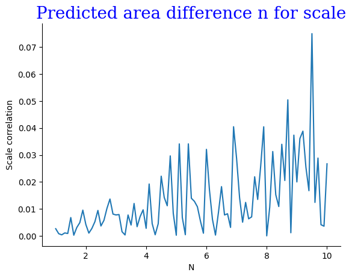

# A1 Алгоритм Монте-Карло для нахождения площади пересечения окружностей на плоскости

[Ccылка на папку со всеми файлами](https://github.com/Babushkin05/HSE_SE_ALGO/tree/main/BDZ3/A1) Визуализируемые данные находятся там

## 1.
Алгоритм Монте-Карло реализовал в [этом файле](https://github.com/Babushkin05/HSE_SE_ALGO/blob/main/BDZ3/A1/A1i.cpp).

## 2.

Собрал данные для визуализации в [этом файле](https://github.com/Babushkin05/HSE_SE_ALGO/blob/main/BDZ3/A1/A1benchmark.cpp)

Визуализировал их в среде ```jupiter nitebook``` в [этом файле](https://github.com/Babushkin05/HSE_SE_ALGO/blob/main/BDZ3/A1/visualize.ipynb)

Давайте рассмотрим графики подробнее:

### Зависимость площади от количества сгенерированных точек


Как мы видим, при увеличении числа точек точность предсказанной площади улучшается

### Разница между правильным значением и предсказанным


С увеличением числа точек улучшается, поэтому и разница с правильным значением становится меньше

### Зависимость площади от масштаба


При увеличении масштаба, вероятность попадания точки в пересечение падает квадратично. При одном и том же количестве точек точность измерения площади падает.

### Разница между правильным значением и предсказанным



Точность измерения падает, поэтому и разница с правильным значением сильно расходится

## Выводы

Для повышения точности, в алгоритмах вычисления площади Методом Монте-Карло нужно увеличивать количество генерировать точек, и при этом выбрать наименьший возможный масштаб.