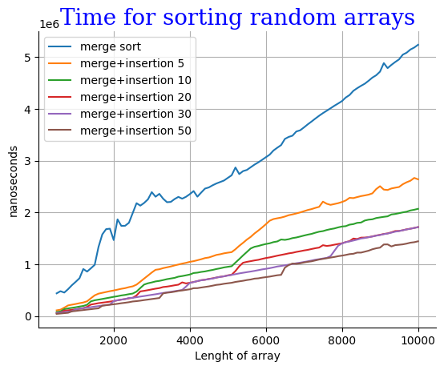
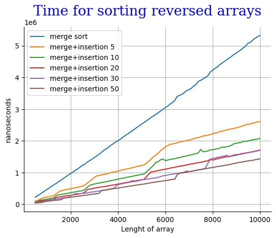
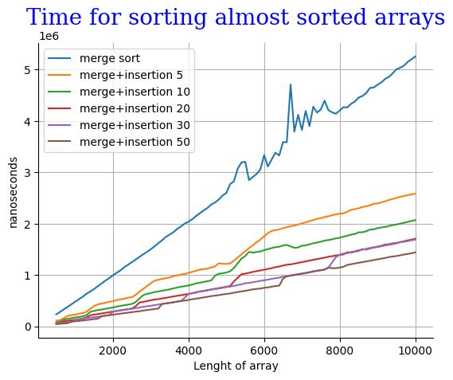

# Анализ MERGE+INSERTION SORT

##

Всю папку можно найти по [ссылке](https://github.com/Babushkin05/HSE_SE_ALGO/blob/main/BDZ3/A2)

Решение A2i по [ссылке](https://github.com/Babushkin05/HSE_SE_ALGO/blob/main/BDZ3/A2/A2i.cpp), айди посылки - ```292649044```

Класс ArrayGenerator можно найти по [ссылке](https://github.com/Babushkin05/HSE_SE_ALGO/blob/main/BDZ3/A2/ArrayGenerator.cpp)

Класс для бенчмарка находится в файле [Benchmark.cpp](https://github.com/Babushkin05/HSE_SE_ALGO/blob/main/BDZ3/A2/Benchmark.cpp)

Выходные данные поместились в файл [tested_data.csv](https://github.com/Babushkin05/HSE_SE_ALGO/blob/main/BDZ3/A2/tested_data.csv)

Данные визуализируюся в файле [visualize.ipynb](https://github.com/Babushkin05/HSE_SE_ALGO/blob/main/BDZ3/A2/visualize.ipynb)

## Анализ результатов

Для всех визуализаций использовались одни и те же массивы, брались их подмассивы [0;n]



Вот график сравнивающий скорость выполнения алгоритмов с разным переходом к сортировке вставками. Как мы видим миксовые алгоритмы работают быстрее, причем чем выше переход к сортировке вставками тем работает быстрее (к тому же я еще попробовал запускать для перехода в 200 и получалось еще быстрее). Это, я думаю, можно обьяснить тем, что длина в 10000 мала для основательных выводов.



Можно вставить сюда все рассуждения к прошлому графике, так еще мы видим что график ```merge sort``` очень ровный, это потому что в каждом слиянии мы в начале пишем все элементы правого подмассива, а потом второго. 



Содержательное обьяснение разброса в районе 7000 найти не удалось, сочтем за статистическую погрешность.

## Вывод

Гибридный алгоритм работает значительно быстрее, и не надо мелочиться с предельным переходом, однако оптимальный передельный переход при таком ограничении количества входных данных найти оптимальный ```threshold``` проблематично.