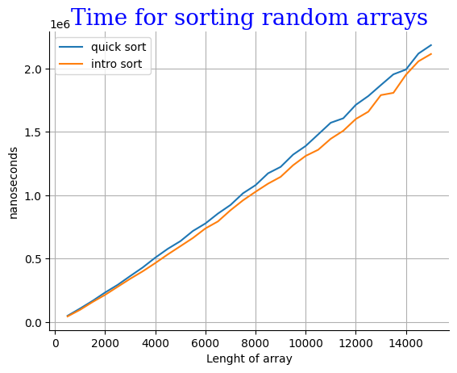
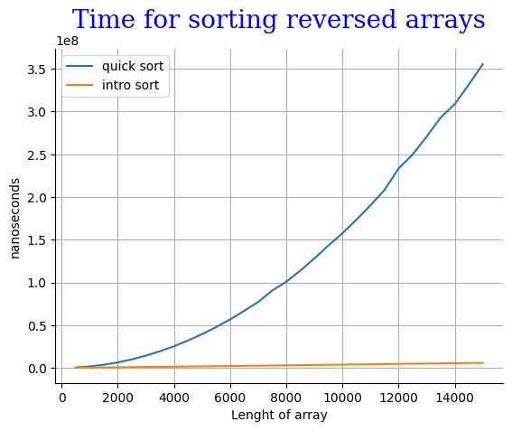
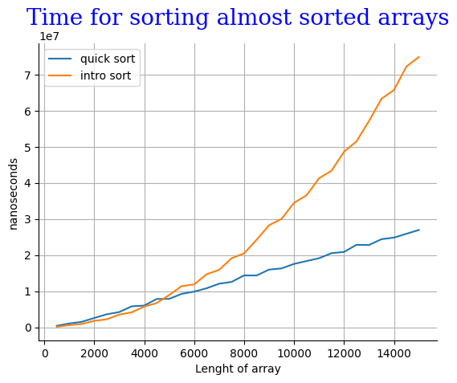

# INTROSORT

Все связанное с решением этой задачи можно найти в моем [репозитории](https://github.com/Babushkin05/HSE_SE_ALGO/tree/main/BDZ3/A3)

В том числе, Решение задачи с кодфорсеса можно найти в файле [A3i.cpp](https://github.com/Babushkin05/HSE_SE_ALGO/blob/main/BDZ3/A3/A3i.cpp). Айди решения : ```292800998```

Генератор эмпирических данных для анализа можно найти в этом файле [benchmark.cpp](https://github.com/Babushkin05/HSE_SE_ALGO/blob/main/BDZ3/A3/benchmark.cpp)

Сразу скажу, что провести анализ на тех же данных как в прошлой задаче не получится, потому что в прошлом бенчмарке, они создавались прямо в нем. Однако они создавались по правилам, определенным в классе ```ArrayGenerator```. Поэтому новые данные я генерировал тоже в нем.

И максимальный размер массива я тоже увеличил, чтобы графики были показательней, однако когда я пробовал делать n сильно больше, время выполнения ```quick sort``` резко возрастало, и было сложнее оценивать графики.

## Анализ



Время выполнения модифицированной сортировки, не сильно меньше базовой, потому тут играет роль только ```threshold```, и не большую.



Тут интересней, потому что в обычной быстрой сортировке, такой случай массива уводит время выполнения в квадратичную зависимость, в то время как наш алгоритм сортирует за $O(nlogn)$. Отсюда и такая внушительная разница.



Если обратиться к тому как я делаю "почти" отсортиванный массив, мы увидем:

```cpp
 static std::vector<int> get_almost_sorted_array() {
    std::vector<int> v = get_random_array();
    std::sort(v.begin(), v.end());
    int k = get_random_number(v.size() / 200, v.size() / 100);
    for (size_t iter = 0; iter < k; ++iter) {
      std::swap(v[iter], v[v.size() - iter - 1]);
    }
    return v;
  }
```

То есть я самые маленькие $0.5$% - $1$% элементов меняю с самыми большими. В итоге ```quick sort``` снова первые $n$ итераций уменьшают подмассив на 1. В то время как ```intro sort``` переходит в таком случае в сортировку кучей.

## Вывод

```Introsort``` Является достойным улцчшением быстрой сортировки, потому что лишает его проблемы в квадратичную зависимость. А также понижает константу переходя в сортировку вставками при малых размерах