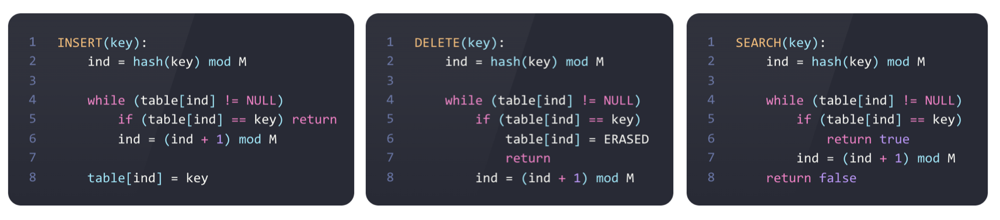

# A1

В хеш-таблице с открытой адресацией разрешение коллизий производится с помощью линейного пробирования. При удалении объекта из хеш-таблицы свободная ячейка получает значение ERASED, отличное от NULL, которое обозначает пустое значение. 

Ниже приведены алгоритмы вставки, удаления и поиска, где M обозначает размер хеш-таблицы:



1. (5 баллов) Приведенные выше алгоритмы вставки, удаления и поиска ключа имеют проблему, которая приводит к долгому выполнению некоторой(-ых) последовательности(-ей) этих операций.
Найдите такую(-ие) последовательность(-и) операций вставки, удаления и поиска.
Охарактеризуйте соответствующее состояние хеш-таблицы. Приведите примеры.

2. (3 балла) Предложите доработки (кроме перехеширования) исходных алгоритмов вставки, удаления и поиска, которые помогут исправить обнаруженную вами проблему. 

## 1

При последовательности команд ```INSERT(a)```, ```DELETE(a)```,  ```INSERT(a)```, ```DELETE(a)```, ```INSERT(a)```, ```DELETE(a)```,...

каждая вставка будет идти вперед до первого ```NULL```, хотя перед ней будут места ```ERASED``` вполне пригодные для вставки туда элемента. 

Так и вызванный поиск после этой последовательности тоже будет вынужден идти вперед до первого ```NULL```, потому что команда удаления создали кластер мусора в таблице.

пример:

таблица резмером 5

```[NULL,NULL,NULL,NULL,NULL]```

после последовательности 
 ```INSERT(a)```, ```DELETE(a)```,  ```INSERT(a)```, ```DELETE(a)```,  ```INSERT(a)```, ```DELETE(a)```,  ```INSERT(a)```, ```DELETE(a)``` , ```INSERT(a)```

 будет иметь вид

 ```[ERASED,ERASED,ERASED,ERASED,a]```

 и вызванный поиск сделает в цикле 5 итераций

## 2

чтобы все стало лучше, нужно исправить код ```INSERT(key)```

на такой

```python
INSERT(key):
    ind = hash(key) mod M

    while(table[ind] != NULL or table[ind] != ERASED)
        if(table[ind] == key)  return

        ind = (ind + 1) mod M
    
    table[ind] = key
```

после такого изменения, так называемые вырезанные кластеры не будут образоваться

в описанном выше примере таблица после выполнения всех команд будет иметь вид

```[a,NULL,NULL,NULL,NULL]```

и цикл в функции поиск будет выполнять лишь 1 итерацию, и кроме того все операции удаления и поиска тоже будут выполнять лишь 1 итерацию цикла