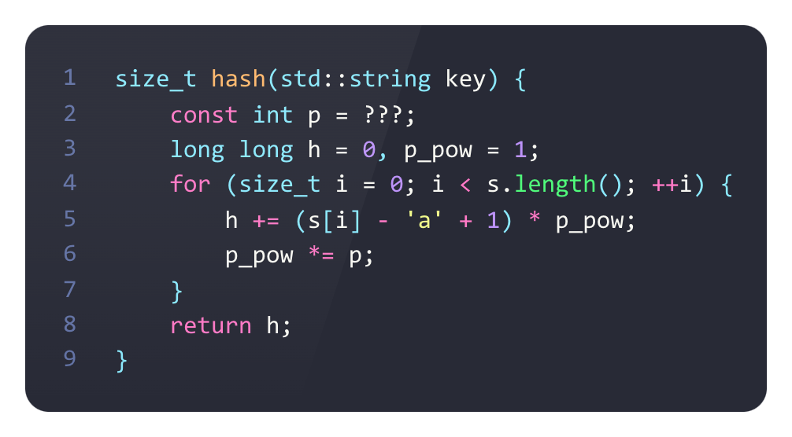
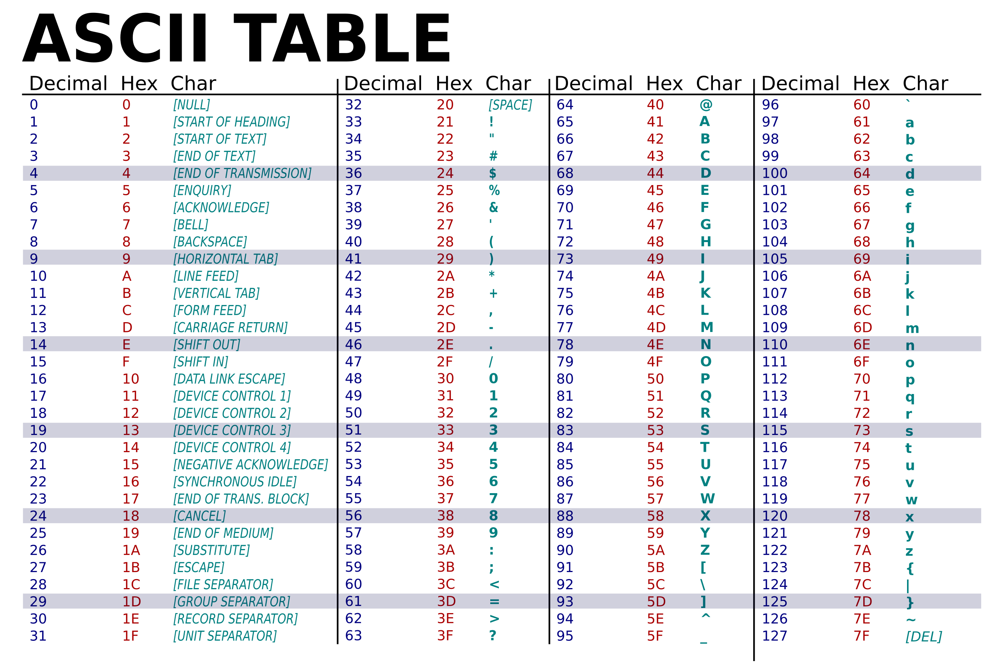

# А3b. Взломщик!

Для хеширования строковых ключей, которые могут содержать строчные/прописные латинские буквы и цифры, используется следующая полиномиальная хеш-функция, значение которой определяется числовым параметром p:



Для того, чтобы взломать хеш-функцию, требуется найти такой набор строк, который вызывает коллизии — одинаковые значения хеш-функции.

* (7 баллов) Одним из способов подбора строк, вызывающих коллизии, является поиск так называемых нейтральных элементов — строк, значение хеш-функции которых обращается в 0. Разработайте и обоснуйте алгоритм поиска строк, состоящих из двух символов, которые будут являться нейтральными элементами. Представьте обоснование и реализацию алгоритма. Ограничений на используемые языки программирования в этом задании нет.
* (3 балла) Найдите нейтральные элементы для всех значений параметра p ≤ 31.

## 1.

Для решения этой задачи нам понадобится таблица ascii



теперь мы можем понять что

```cpp
(s[i] - 'a' + 1)
```

можно описать более удобно:

* если ***s[i]*** строчная буква, то это выражение будет равно ее номеру, начиная с единицы

* если ***s[i]*** прописная буква, то выражение будет равно ее номеру минус 32

* если же ***s[i]*** цифра, то выражение будет равно ей минус 67

тогда хеш-функция будет зануляться только если один из ее символов сточная буква, а другой либо прописная либо цифра.

***в задании сказано найти алгоритм поиска всех строк из двух элементов подходящих под условие, и не сказано что это не должно быть брутфорсом, тем более в данном случае он работает за О(1) и вычисляет быстро. Тем не менее скорее всего авторы ожидают более элегантное решение, поэтому найду его***
