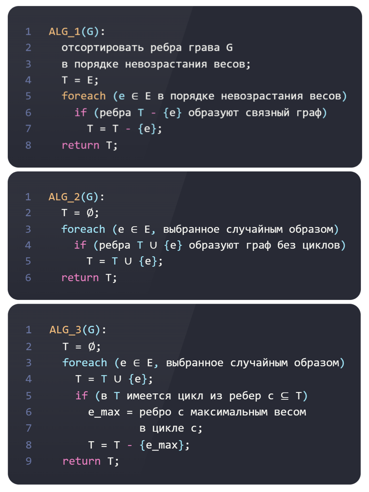

<script type="text/javascript"
  src="https://cdnjs.cloudflare.com/ajax/libs/mathjax/2.7.0/MathJax.js?config=TeX-AMS_CHTML">
</script>
<script type="text/x-mathjax-config">
  MathJax.Hub.Config({
    tex2jax: {
      inlineMath: [['$','$'], ['\\(','\\)']],
      processEscapes: true},
      jax: ["input/TeX","input/MathML","input/AsciiMath","output/CommonHTML"],
      extensions: ["tex2jax.js","mml2jax.js","asciimath2jax.js","MathMenu.js","MathZoom.js","AssistiveMML.js", "[Contrib]/a11y/accessibility-menu.js"],
      TeX: {
      extensions: ["AMSmath.js","AMSsymbols.js","noErrors.js","noUndefined.js"],
      equationNumbers: {
      autoNumber: "AMS"
      }
    }
  });
</script>


# A1. Как построить минимальный остов?


Ниже приведены три алгоритма ALG_1, ALG_2 и ALG_3, которые из заданного связного неориентированного графа G = (V, E) выбирают некоторое множество его ребер T.



(7 баллов) Для каждого из трех представленных алгоритмов обоснуйте его наиболее эффективную по временной сложности реализацию, в особенности, с точки зрения используемых структур данных и операций на них. Обоснуйте оценки сложности. Представьте исходный код на языке C++ для каждой из соответствующих реализаций, в которых используемые структуры данных достаточно отразить на уровне интерфейса - приводить полный код используемых структур данных не нужно.
(5 баллов) Для каждого из трех представленных алгоритмов определите, формируется ли в множестве ребер T минимальное остовное дерево исходного графа G. Обоснуйте свой ответ и приведите (контр)примеры.

## ALG_1

```cpp
std::pair<AdjLists, int> ALG_1(std::vector<std::tuple<int,int,int> edges, std::vector<std::pair<int,int>> adjs) {
    // сортируем ребра графа
    std::sort(edges.begin(), edges.end(), 
        [](auto l, auto r) { 
            return l.weight > r.weight; 
        }
    );
    int cost = 0;

    for (auto [a, b, w] : edges) {
        adjs[a].remove({b, w});
        adjs[b].remove({a, w});

        if (!IsConnected(adjs)) {
            adjs[a].emplace_back(b, w);
            adjs[b].emplace_back(a, w);
            cost += weight;
        }
    }
}
```


### разберем структуры данных

```
std::vector<std::tuple<int,int,int> edges
```
вектор ребер (начало, конец, вес)

```
std::vector<std::pair<int,int>> adj
```

список смежности

```
IsConnected(adjs)
```

проверка связен ли граф (через DFS)

### Анализ сложности

Сортировка будет работать за $O(ElogE)$, где $E$ количество ребер

А цикл будет работать за $O(E(V+E))$, где $(V+E)$, достигаются за счет проверки через DFS

Тогда итоговая сложность $O(ElogE + E(V + E))$

### Выполняет ли задачу

Правда что алгоритм строит остовное дерево, потому что удаляет каждые возникшие циклы. Допустим алгоритм строит не минимальное дерево. Тогда на каком-то шаге алгоритм удалил дешевое ребро и вместо него поставил дорогое, но алгоритм работает наоборот противоречие.

## ALG_2

```cpp
std::pair<std::vector<std::tuple<int,int,int>, int> ALG_2(std::vector<std::tuple<int,int,int> & edges, int n) {
    std::shuffle(edges.begin(), edges.end(), std::default_random_engine{});
    std::vector<std::tuple<int,int,int>  mst{};
    Union_Find dsu{n};
    int cost = 0;

    for (auto e : edges) {
        if (dsu.Find(e.u) != dsu.Find(e.v)) {
            mst.push_back(e);
            dsu.Union(e.u, e.v);
            cost += e.weight;
        }
    }
    return {mst, cost};
}
```

### разберем структуры данных

```
std::vector<std::tuple<int,int,int> edges
```
вектор ребер (начало, конец, вес)

```
Union_Find
```

класс системы непересекающихся множеств

### Анализ сложности

Мы перебираем все ребра графа и на каждом шаге делаем ограниченное количество операций с системой непересекающихся множеств

Тогда временная сложность $O(E*\alpha(V))$

### Выполняет ли задачу

Этот алгоритм работает как алгоритм Краскала, но не упорядочивает все вершины. Поэтому алгоритм никак не работает.

## ALG_3

```cpp
std::pair<std::vector<std::pair<int,int>>, int> ALG_3(Edges& edges, int n) {
    std::vector<std::pair<int,int>> mst(n);
    std::shuffle(edges.begin(), edges.end(), std::default_random_engine{});
    Union_Dind dsu{n};
    int cost = 0;

    for (auto e : edges) {
        if (dsu.Find(e.u) != dsu.Find(e.v)) {
            mst[e.u].emplace_back(e.v, e.weight);
            mst[e.v].emplace_back(e.u, e.weight);
        } 
        else {
            auto cycle = FindCycle(e.u);
            int max_weight = 0;
            int to_remove_start = -1, to_remove_end = -1;
            for (int i = 0; i < cycle.size() - 1; ++i) {
                int u = cycle[i];
                int v = cycle[i + 1];
                int new_weight = std::find_if(edges.begin(), edges.end(), [&](auto e) {
                return (
                    e.u == u && e.v == v) || (e.u == v && e.v == u);
                })->weight;
                if (new_weight > max_weight) {
                    max_weight = new_weight;
                    to_remove_start = u;
                    to_remove_end = v;
                }
            }

            if (max_weight > e.weight) {
                mst[to_remove_start].remove({to_remove_end, max_weight});
                mst[to_remove_end].remove({to_remove_start, max_weight});
                mst[e.u].emplace_back(e.v, e.weight);
                mst[e.v].emplace_back(e.u, e.weight);
                cost += e.weight - max_weight;
            }
        }
    }
    return {mst, cost};
}
```

### разберем структуры данных

```
std::vector<std::tuple<int,int,int> edges
```
вектор ребер (начало, конец, вес)

```
Union_Find
```

класс системы непересекающихся множеств

### Анализ сложности

$O(E(\alpha(V) + V  + E))$

### Выполняет ли задачу


