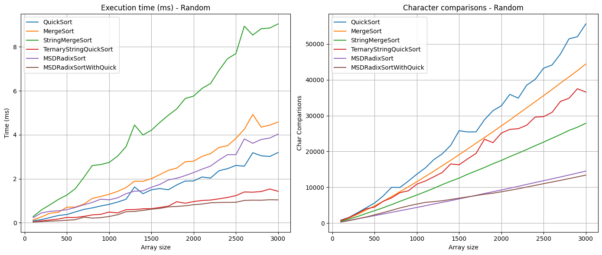
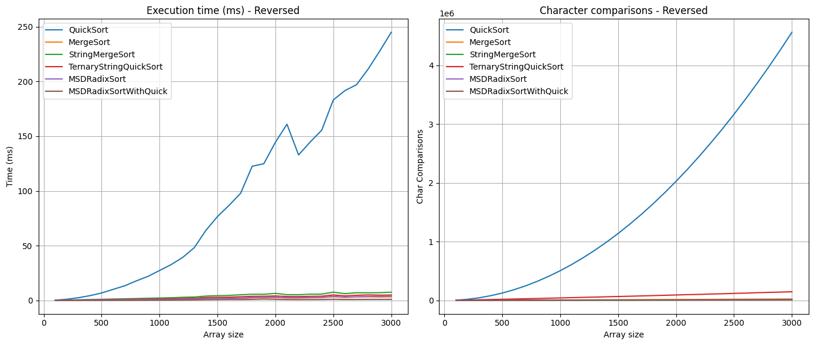
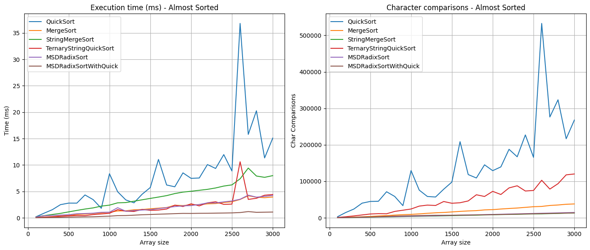

# А1 Анализ строковых сортировок

Бабушкин, 237

## решения на cf:

[A1m.cpp](https://github.com/Babushkin05/HSE_SE_ALGO/blob/main/BDZ9/A1m.cpp) - 321294819

[A1q.cpp](https://github.com/Babushkin05/HSE_SE_ALGO/blob/main/BDZ9/A1q.cpp) - 321295261

## анализ

я решил собрать прямо проект на c++ — с делением на хедеры и реализацию, разделить в отдельные директории, написать для них CMakeLists, чтобы максимально просто было собирать

структура:

```
├── [CMakeLists.txt]
├── README.md
├── build
├── generate-pics.ipynb
├── include
│   ├── StringGenerator.h
│   ├── StringSortTester.h
│   └── algorithms
│       ├── MSDRadixSort.h
│       ├── MSDRadixSortWithQuick.h
│       ├── MergeSort.h
│       ├── QuickSort.h
│       ├── StringMergeSort.h
│       └── TernaryStringQuickSort.h
├── results
└── src
    ├── StringGenerator.cpp
    ├── StringSortTester.cpp
    ├── algorithms
    │   ├── MSDRadixSort.cpp
    │   ├── MSDRadixSortWithQuick.cpp
    │   ├── MergeSort.cpp
    │   ├── QuickSort.cpp
    │   ├── StringMergeSort.cpp
    │   └── TernaryStringQuickSort.cpp
    └── main.cpp
```

## реализация алгоритмов

все алгоритмы я оформлял отдельно в папке `include/algorithms` и реализовывал в `src/algorithms`, каждый алгоритм — это отдельный `.h/.cpp` файл. стараюсь соблюдать читаемость: хедер — только интерфейс, `.cpp` — только реализация.

для всех алгоритмов счётчик символов передаётся по ссылке `size_t& charComparisons`, и он учитывает только **посимвольные сравнения**, как и требовалось.

### стандартные алгоритмы

- `QuickSort` — обычный `quicksort` со сравнением строк через `less(a, b, cmp)`, считает сравнения вручную.
- `MergeSort` — базовый `mergesort`, стабильно сортирует, также через `less` считает посимвольные сравнения.

### специализированные

- `TernaryStringQuickSort` — реализация тернарной быстрой сортировки, как в лекциях (троичное разбиение по символу `charAt(str, d)`).
- `StringMergeSort` — merge sort с оптимизацией по LCP. при слиянии считаю общий префикс двух строк и начинаю сравнивать с этого места — это даёт хороший буст при почти отсортированных данных.
- `MSDRadixSort` — MSD radix sort по символам, базовая реализация, алфавит — 256 символов (`unsigned char`).
- `MSDRadixSortWithQuick` — тот же MSD, но если подмассив маленький (меньше 16), то вместо дальнейшей рекурсии запускается `TernaryStringQuickSort`. это помогает избавиться от лишней рекурсии на «мусорных» данных и ускоряет финальные этапы сортировки.

во всех этих реализациях стараюсь минимально копировать строки, везде передаю ссылки и индексирую.

## генерация и тестирование

написал `StringGenerator` — умеет делать:

- случайные строки из алфавита (74 символа, как в задании)
- строки заданной длины (от 10 до 200 символов)
- случайные, обратные и почти отсортированные массивы (перестановки 2% элементов)

чтобы не генерировать всё заново на каждый прогон, заранее создаю по 3000 строк для каждого типа, и потом просто беру нужные префиксы (`getDatasetSubset`). это экономит много времени при множественных замерах.

для тестов написал `StringSortTester`. он умеет:

- принимать любой `std::function<void(vector<string>&, size_t&)>`
- мерить `std::chrono::high_resolution_clock` время
- подсчитывать количество посимвольных сравнений
- возвращает `SortResult {timeMillis, charComparisons}`

в `main.cpp` на каждую длину (от 100 до 3000 с шагом 100) делаю 5 прогонов, беру среднее и записываю в `.csv`.

## generate-pics.ipynb

весь анализ провожу в `generate-pics.ipynb`. он делает:

- парсит все `.csv` из папки `results/`
- группирует по типу данных (`random`, `reversed`, `almost_sorted`)
- строит **два графика на каждом холсте**:
  - слева: время в миллисекундах от размера массива
  - справа: количество посимвольных сравнений
- использует `matplotlib` и `pandas`, цвета и стили одинаковые для всех графиков

на графиках сразу видно, как, например:

- `MSDRadixSortWithQuick` стабильно быстрее других при `random` и `reversed`
- `StringMergeSort` хорошо ведёт себя на `almost_sorted`
- у `QuickSort` всегда больше символов, чем у спец. алгоритмов

всё сохраняю в `summary_random.png`, `summary_reversed.png` и `summary_almost_sorted.png`, чтобы вставить потом в отчёт.

## результаты

### случайные массива

как мы видим, наши оптимизированные алгоритмы работают лучше, и как ожидается лучше всех MSDRADIX с переключением



### обратно отсортированные массивы

QuickSort уходит в квадратичную сложность из-за того, что pivot в моей реализации выбирается не случайно




### почти отсортированные массивы

снова QuickSort хуже всех, потому что при почти отсортированных данных, рекурсивное разбиение по pivot почти всегда является не равномерным.

