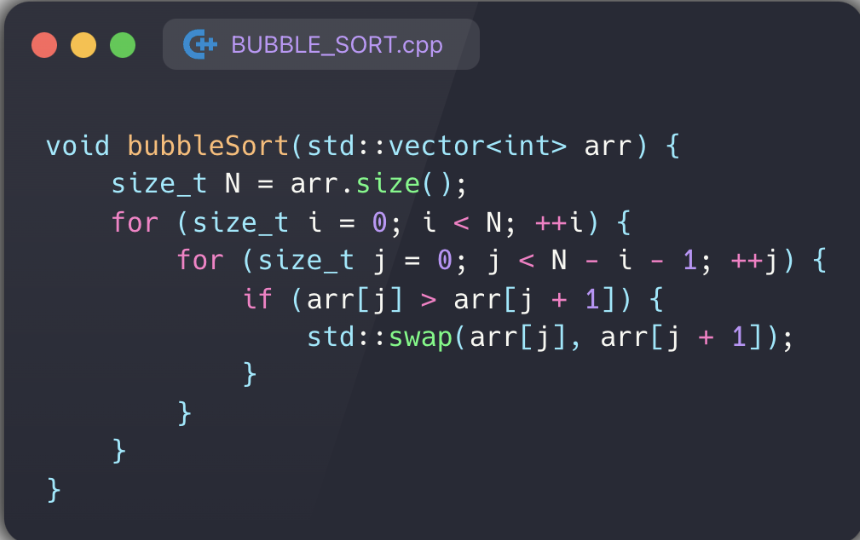
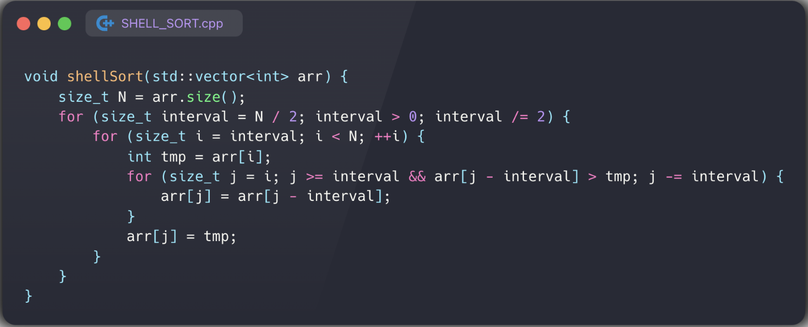

# ДЗ 1 Анализ алгоритмов

## Сортировка пузырьком



### Доказательство через инвариант

Инвариант возьмем такой:

В конце $i$-того цикла последние $i+1$ элементов стоят на своих местах (т.е. стоят так, как стояи бы в отсортированном массиве)

на 0 шаге это выполняется (в цикле по $j$ мы отправим самый больший элемент в конец)

на $i$-том шаге у нас неотсортированными остаются $n-i$ первых элементов(потому что инвариант работал на $i-1$ шаге). Максимальный из них встанет на $N-i-1$ место благодаря циклу по $j$. Инвариант выполняется.

В конце последнего шага окажется, что последние $i+1=N$ элементов отсортированны. инвариант выполняется.

###  Временная оценка сложности

#### Худший случай

худшим случаем у нас будет являтся отсортированный по невозрастанию изначальный массив, потому что ```swap``` будет выполняться каждый раз.

для каждого $j$ будет выполнятся 2 действия - проверка условия и своп

итого у нас будет выполнено столько действий:

$\sum_0^N2*\sum_0^{N-i-1}2*2=8\sum_0^N*\sum_0^{N-i-1}1=4(N-1)N$

Здесь двойки отвечают за проверку условия и прибавление единицы в цикле(инициализация и проверка условия на 1 шаге)

тогда 

$T(N)=4N^2-4N\to4N^2$

#### Лучший случай

в лучшем случае наш массив уже отсортирован

тогда для каждого $j$ нам придется сделать только проверку условия (не придется свопать), то есть в 2 раза меньше действий

тогда $T(N)=2N^2$

## Алгоритм Шелла



### Доказательство через инвариант

инвариант:

В конце выполнения интервала $k$, каждая последовательность элементов удаленных друг от друга на $nk,n\in N$ отсортирована по возрастанию

проверим его на всех этапах.

на нулевом шаге интервал равен $N$, поэтому все элементы находятся в разных последовательностях, значит инвариант выполняется.

на произвольном шаге мы сортируем вставками каждую такую последовательность, поэтому инвариант выполняется.

В конце интервал равен 1 и массив отсортирован, инвариант вполняется.

### Временная оценка сложности