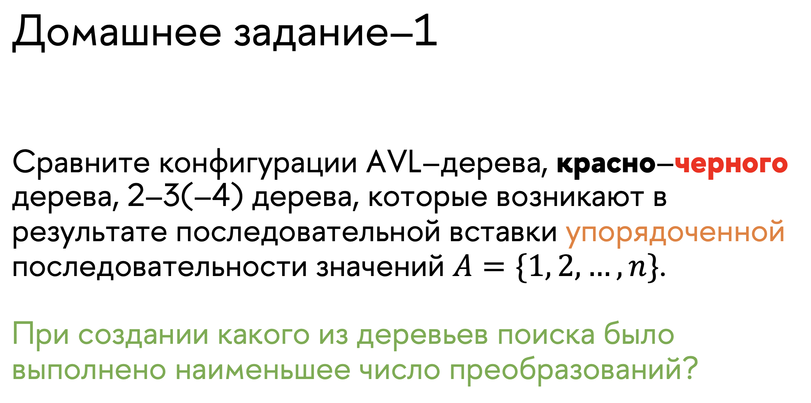
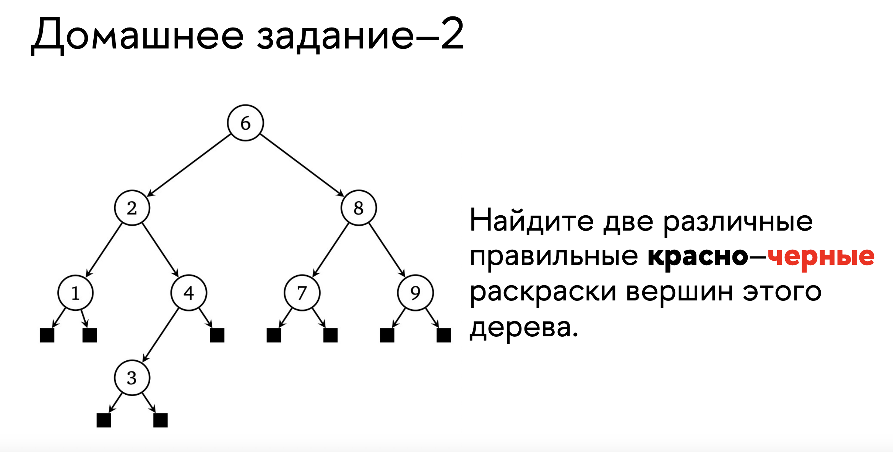
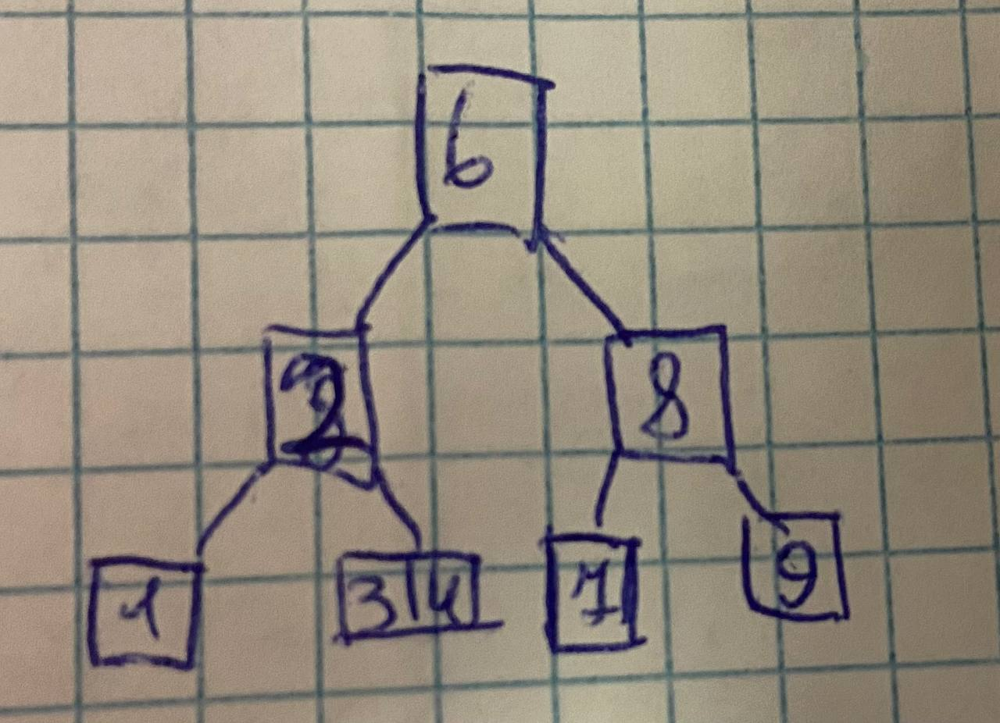
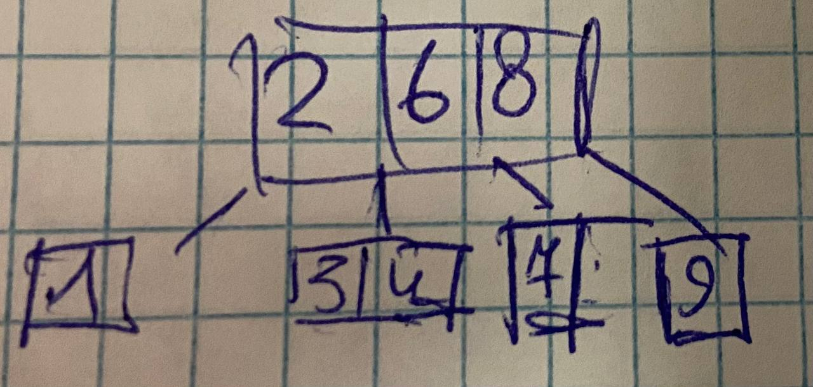

# ДЗ ПО АИСД БАБУШКИН

[построение 2-3-4 дерева](assets/cs1.jpg)

## Домашняя работа

Я последовательно вставил элементы от 1 до 10 в эти деревья

[AVL](assets/hw1avl.jpg) : получилось 17 этапов (не считая операций для для проверки высоты)

[2-3](assets/hw12-3.jpg) : получилось 15 этапов

[Левостороннее красно-черное](assets/hw1rb.jpg): 22 этапа

В итоге получилось что быстрее всего построилось 2-3 деревно (2-3-4 было бы еще быстрее из-за меньшего количества подьемов элементов вверх)

Заметим, что вершина 2 всегда должна быть красной, иначе высота соответствующего 2-3-4 дерева будет не константной

Теперь можно предложить два варианта: 

все остальные вершины  черные

2 и 8 красные

### Верно ли, что любое поддерво красно–черного дерева также само является правильным красно–черным деревом?

Неверно, потому что существуют поддеревья с красной вершиной.

### Верно ли, что длина самого длинного пути от корня до листа в красно–черном дереве не более, чем в два раза превосходить длину самого короткого?

В 2-3-4 дереве действует правило, что высота всегда одинакова для любого листа, поэтому в соответствующем красночерном дереве действует правило, что количество черных вершин в пути до каждого листа одинаково. А поскольку красные вершины не могу идти подряд, в худшем случае они будут чередоваться

Вот и получается что может быть лист все предки которого черные, и другой лист где все предки чередуются, отсюда и исходит максимальная разница в 2 раза.