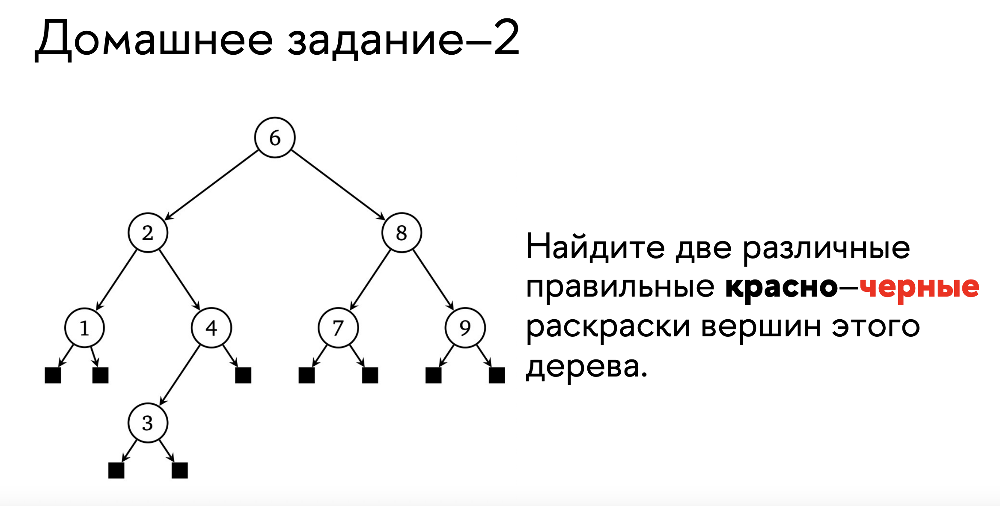

# ДЗ ПО АИСД БАБУШКИН

[построение 2-3-4 дерева](assets/cs1.jpg)

## Домашняя работа

Я последовательно вставил элементы от 1 до 10 в эти деревья

[AVL](assets/hw1avl.jpg) : получилось 17 этапов (не считая операций для для проверки высоты)

[2-3](assets/hw12-3.jpg) : получилось 15 этапов

[Левостороннее красно-черное](assets/hw1rb.jpg): 22 этапа

В итоге получилось что быстрее всего построилось 2-3 деревно (2-3-4 было бы еще быстрее из-за меньшего количества подьемов элементов вверх)

