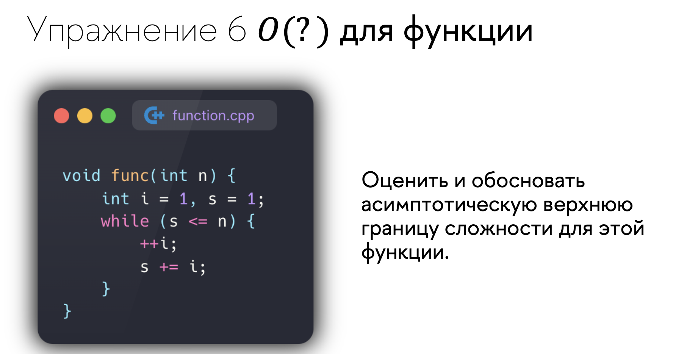

<script type="text/javascript"
  src="https://cdnjs.cloudflare.com/ajax/libs/mathjax/2.7.0/MathJax.js?config=TeX-AMS_CHTML">
</script>
<script type="text/x-mathjax-config">
  MathJax.Hub.Config({
    tex2jax: {
      inlineMath: [['$','$'], ['\\(','\\)']],
      processEscapes: true},
      jax: ["input/TeX","input/MathML","input/AsciiMath","output/CommonHTML"],
      extensions: ["tex2jax.js","mml2jax.js","asciimath2jax.js","MathMenu.js","MathZoom.js","AssistiveMML.js", "[Contrib]/a11y/accessibility-menu.js"],
      TeX: {
      extensions: ["AMSmath.js","AMSsymbols.js","noErrors.js","noUndefined.js"],
      equationNumbers: {
      autoNumber: "AMS"
      }
    }
  });
</script>


# dz3


## 5.1


второй алгоритм эффективнее

$0.1n^2log_{10}n\geq2.5n^2$

$log_{10}n\geq25$

выполняется начиная с $n=10^{25}$


если размер входных данных меньше $10^9$ лучше пользоваться 1м алгоритмом

## 6



мы будем складывать числа пока сумма $1+..+k$ не станет больше чем $n$ 

тогда получится, что

$\dfrac{k(k+1)}{2}\geq n$

$k^2+k\geq 2n$

$k^2+k-2n \geq 0$

$k\geq \frac{1+\sqrt{1+4n}}{2}$

именно $k$ раз будет выполнятся цикл

тогда верхняя граница сложности:

$O(N) = \sqrt{N}$

## Последний слайд


## 1. Оценить и обосновать асимптотическую верхнюю границу сложности для этой функции.

Этот алгоритм ищет максимальную сумму чисел на подотрезке длины $k$

алгоритм перебирает элементы начала отрезка, и для каждого начала считает сумму этого отрезка

$T(N,K) = 2+C(N-K)K$

поэтому верхняя граница сложности для этого алгоритма:


$O(N,K) = NK$

действительно, $2+C(N-K)K<NK$ 

например при $N>K>10$

## 2. Как можно улучшить/оптимизировать этот алгоритм? Разработайте оптимизированный алгоритмов и обоснуйте его сложность.

можно воспользоваться методом скользящего окна, то есть не пересчитывать сумму для каждого отрезка, а считать используя уже подсчитанные данные.

```cpp
#include <vector>

int fast_find_max_sum(const std::vector<int>& arr, int k) {
    int n = arr.size();
    int max_sum = INT_MIN;
    int cur_sum = 0;

    for(size_t i = 0; i < k; ++i){
        cur_sum+=arr[i];
    }

    max_sum = std::max(max_sum,cur_sum);

    for(size_t i = k; i< n; ++i){
        cur_sum-=arr[i-k];
        cur_sum+=arr[i];
        max_sum = std::max(max_sum,cur_sum);
    }

    return max_sum;
}
```

в этом алгоритме я избавился от вложенного цикла, тем самым привел его к линейному виду

$T(N) = 4+K+N-K=N+4$

тогда верхняя граница

$O(N) = N$