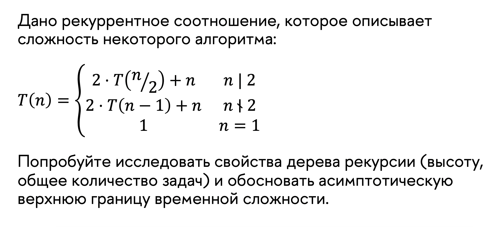

# Домашнее задание с 5 семинара

## Перемешивание части массива третями

```python
def shuffle(A, l, r):
    if l < r:
        thrd = (r – l) / 3
        shuffle(A, l, l + thrd – 1)
        shuffle(A, r – thrd + 1, r)
        for i = 0 to thrd – 1:
            swap(A[l + thrd + i], A[l + 2 * thrd + i])
```

### 1. Cоставить рекуррентное соотношение, которое описывает время работы алгоритма shuffle.

$\begin{cases}
T(n) = 2T(n/3) +O(n)\\\\
T(1) = O(1)
\end{cases}$


### 2. Вычислить верхнюю границу временной сложности данного алгоритма.

по мастер теореме разделяй-и-властвуй:

$T(n) = O(n)$

## Задача трех $T$



давайте попробуем найти количество уровней в дереве(пока абстрагируемся от количества вызванных рекурсий и '+n')

возьмем какое-нибудь число в двоичной записи, оно будет на каждом уровне изменятся так:

1101101

1101100

110110

11011

11010

1101

1100

110

11

10

1


таким образом каждое число будет иметь высоту дерева рекурсий в

```c++
    height = std::log2(n) + std::popcount(n);
```


таким образом в худшем случае $n=2^k-1$
```c++
    height = 2 * std::log2(n);
```

так как мы ищем верхнюю границу, нам интересен этот случай

воспользуемся методом итерации:

$T(n) = 2T(n-1)+n=4T((n-1)/2)+2(n-1)+n = $

$8T(\frac{n-1}{2}-1)+4\frac{n-1}{2}+2(n-1)+n=16T(\frac{\frac{n-1}{2}-1}{2}) +8(\frac{n-1}{2}-1)+4\frac{n-1}{2}+2(n-1)+n=$

$16T(\frac{\frac{n-1}{2}-1}{2}) +8(\frac{n-1}{2}-1)+2(n-1)+2(n-1)+n=$

$=...\to \sum^{log_2k}2^i2\frac{n}{2^i}=\sum^{log_2n}2n=2nlogn$

тогда $T(n)=O(nlogn)$